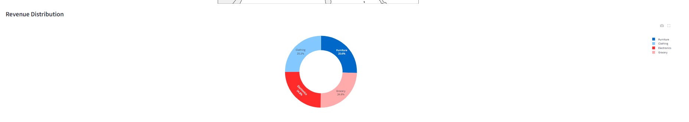
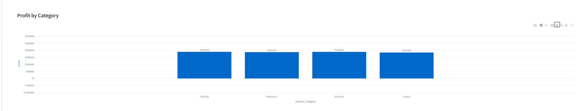
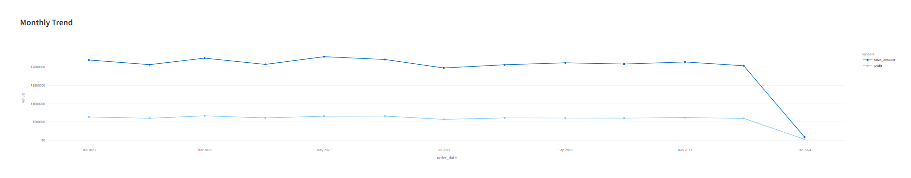

[](https://arshya-profitability-analytics.streamlit.app/)

# Revenue Leakage & Profitability Analytics Dashboard

**Business Problem:** High revenue does not always translate into strong profitability. Hidden leakages such as excessive discounting, loss-making transactions, and uneven regional performance can reduce overall business value despite healthy sales figures.

**Objective:** Identify profitability gaps, quantify revenue leakage, and provide actionable recommendations using SQL-driven analysis and an interactive Streamlit dashboard.

---

## Live Demo

https://arshya-profitability-analytics.streamlit.app/

---

## Executive Summary

This project investigates revenue leakage and profitability drivers using SQL, MySQL, Python, and Streamlit.

The analysis focuses on identifying:

* Loss-making transactions
* Discount-related profit erosion
* Regional performance differences
* Category-level profitability trends
* Revenue versus profit trade-offs

The goal is to move beyond revenue reporting and understand which areas of the business actually generate sustainable profit.

---

## Key Business Metrics

| Metric             | Value                             |
| ------------------ | --------------------------------- |
| Total Revenue      | ₹2.55 Cr                          |
| Total Profit       | ₹74.94 L                          |
| Profit Margin      | 29.37%                            |
| Loss-Making Orders | 13                                |
| Revenue Leakage    | Investigated through SQL analysis |

These KPIs demonstrate that while revenue remains strong, profitability must be monitored independently to identify hidden operational inefficiencies.

---

## Business Questions

The project was designed to answer the following questions:

1. Which categories contribute the most profit?
2. Are discounts reducing profitability?
3. Which regions perform best and worst?
4. How many transactions generate losses?
5. Does revenue growth always translate into profit growth?
6. Where are potential revenue leakages occurring?

---

## SQL Investigation

The analysis was driven primarily through SQL before being visualized in Streamlit.

### KPI Summary

```sql
SELECT 
    COUNT(*) AS total_orders,
    SUM(sales_amount) AS total_revenue,
    SUM(profit) AS total_profit,
    ROUND(SUM(profit) / SUM(sales_amount) * 100, 2) AS profit_margin_pct
FROM orders;
```

Used to calculate core business metrics including revenue, profit, and overall margin.

---

### Revenue Leakage Analysis

```sql
SELECT *
FROM orders
WHERE profit < 0
ORDER BY profit ASC;
```

Used to identify loss-making transactions that directly contribute to revenue leakage.

---

### Discount Impact Analysis

```sql
SELECT 
    product_category,
    ROUND(AVG(discount), 2) AS avg_discount,
    ROUND(AVG(profit), 2) AS avg_profit
FROM orders
GROUP BY product_category
ORDER BY avg_discount DESC;
```

Used to measure how discounting influences profitability across product categories.

---

### Regional Performance Analysis

```sql
SELECT 
    region,
    SUM(sales_amount) AS total_sales,
    SUM(profit) AS total_profit
FROM orders
GROUP BY region
ORDER BY total_profit DESC;
```

Used to identify high-performing and underperforming regions.

---

## Analysis & Findings

### Sales Across India


#### Finding

Revenue generation is uneven across regions, indicating reliance on a limited number of strong-performing markets.

#### Business Impact

Heavy dependence on a few regions increases operational risk and limits balanced growth opportunities.

#### Recommendation

Develop targeted expansion strategies for lower-performing regions while maintaining performance in established markets.

---

### Revenue Distribution by Category



#### Finding

Revenue contribution is remarkably balanced across categories:

* Electronics: ~25.8%
* Furniture: ~25.6%
* Clothing: ~25.1%
* Grocery: ~24.6%

#### Business Impact

Revenue diversification reduces dependence on any single product category, improving overall business resilience.

#### Recommendation

Continue monitoring profitability alongside revenue, as equal sales contribution does not necessarily imply equal business value.

---

### Profit by Category



#### Finding

Category profits remain relatively close:

* Clothing: ₹18.93 L
* Furniture: ₹18.88 L
* Electronics: ₹18.71 L
* Grocery: ₹18.41 L

#### Business Impact

While revenue appears evenly distributed, profitability varies slightly between categories, suggesting opportunities for pricing and discount optimization.

#### Recommendation

Review pricing strategy and discount structures to improve margins in lower-performing categories.

---

### Monthly Revenue & Profit Trend



#### Finding

Revenue remains consistently strong throughout the year, while profit fluctuates more noticeably.

#### Business Impact

Stable sales combined with varying profit levels indicate that profitability is influenced by factors beyond revenue alone, including discounts, costs, and transaction quality.

#### Recommendation

Track profit as a primary KPI alongside revenue rather than relying solely on sales performance.

---

### Full Dashboard


The Streamlit dashboard combines KPIs, category analysis, regional performance, profitability metrics, and revenue leakage indicators into a single interactive interface.

Users can:

* Filter by region
* Filter by category
* Explore profitability trends
* Monitor revenue leakage indicators
* Compare revenue and profit performance

---

## Key Insights

* The business generated ₹2.55 Cr in revenue and ₹74.94 L in profit.
* Overall profit margin stands at 29.37%.
* Only 13 transactions generated losses, making them high-priority targets for investigation.
* Revenue is distributed evenly across categories, reducing dependency risk.
* Profitability varies independently of revenue, reinforcing the need for margin-focused decision-making.
* Regional performance differences suggest opportunities for expansion and optimization.

---

## Strategic Recommendations

### Control Discounting

Monitor high-discount transactions and establish discount thresholds to prevent unnecessary margin erosion.

### Prioritize Profitability

Evaluate performance using both revenue and profit metrics rather than revenue alone.

### Investigate Loss-Making Orders

Review the 13 loss-making transactions to identify recurring causes and prevent future leakage.

### Strengthen Underperforming Regions

Allocate marketing and operational resources toward regions with lower profitability potential.

### Category-Level Optimization

Use category profitability trends to improve pricing, inventory planning, and promotional strategies.

---

## Tech Stack

* Python
* MySQL
* SQL
* Streamlit
* Plotly
* Pandas
* dotenv

---

## Challenges

* Secure database credential management
* Data cleaning and consistency validation
* Profitability analysis beyond simple revenue reporting
* Translating SQL findings into business recommendations

---

## Future Improvements

* Real-time data integration
* Automated anomaly detection
* Revenue leakage alerts
* Predictive profitability forecasting
* Customer segmentation analysis

---

## Running the Project

```bash
git clone <repository-url>
cd revenue-leakage-profitability-analytics
pip install -r requirements.txt
streamlit run app.py
```

---

## Conclusion

Revenue alone can create a misleading view of business performance. This project demonstrates how SQL-driven analysis can uncover hidden profitability issues, quantify revenue leakage, and support better business decisions through data-driven insights.
