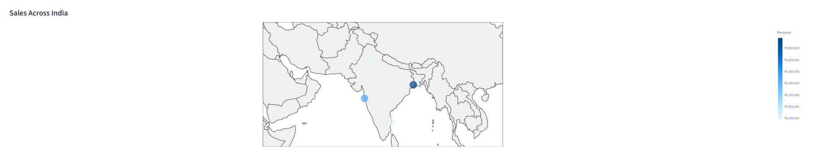
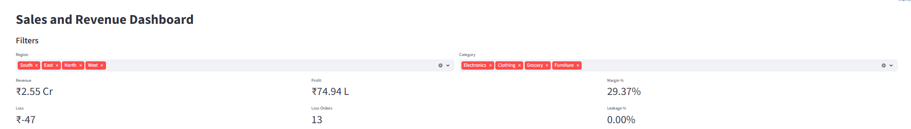

# Revenue Leakage & Profitability Analytics Dashboard

##  Executive Summary

Built an end-to-end analytics solution using SQL and Streamlit to identify revenue leakage and profitability gaps.
The dashboard highlights loss-making orders, discount impact, and regional performance, enabling data-driven decision-making.

##  Business Problem

Despite strong revenue, businesses often face hidden **profit leakage** due to:

* Excessive discounting
* Loss-making transactions
* Regional inefficiencies

The goal of this project is to identify **where profit is lost and how to improve it**.

##  Tech Stack

* Python (Pandas, Streamlit)
* MySQL
* Plotly
* dotenv

#  Analysis & Insights

## 🌍 Sales Across India



** Path:**

```text
visualizations/Map.png
```

** Data Used:**

* Region-wise total sales aggregated from MySQL
* Query: `SUM(sales_amount) GROUP BY region`

** Insight:**
Sales are unevenly distributed across regions, with certain regions contributing significantly more revenue.

** Interpretation:**
The business is highly dependent on a few regions, increasing risk and limiting growth elsewhere.

** Mitigation:**
Expand operations and marketing in underperforming regions using targeted strategies.


##  Revenue Distribution by Category


** Path:**

```text
visualizations/Donut.png
```

** Data Used:**

* Total revenue grouped by product category

** Insight:**
Revenue is relatively balanced across categories.

** Interpretation:**
While diversification reduces risk, it may hide low-margin categories.

** Mitigation:**
Combine revenue with profit analysis to identify high-value categories.


##  Profit by Category


**📁 Path:**

```text
visualizations/Bar.png
```

** Data Used:**

* Total profit grouped by product category

** Insight:**
Some categories generate lower profit despite similar revenue.

** Interpretation:**
Indicates margin inefficiencies due to pricing or discounting.

** Mitigation:**
Optimize pricing and reduce discounts in low-margin categories.


##  Monthly Revenue & Profit Trend


** Path:**

```text
visualizations/Line.png
```

** Data Used:**

* Monthly aggregation of revenue and profit

** Insight:**
Revenue is stable, but profit fluctuates.

** Interpretation:**
Profit instability suggests inconsistent cost or discount strategies.

** Mitigation:**
Standardize discount policies and monitor profitability closely.


##  Full Dashboard



** Path:**

```text
visualizations/Dashboard.png
```

** Description:**
Interactive dashboard built using Streamlit with filters, KPIs, and visualizations for real-time analysis.


##  Key Findings

*  Discounts above 15% significantly reduce profitability
*  Presence of consistent loss-making transactions
*  Profit variability is not aligned with revenue trends
*  Regional imbalance impacts overall performance


##  Strategic Recommendations

* Implement discount caps to protect margins
* Monitor and eliminate loss-making orders
* Shift focus from revenue to profit-driven KPIs
* Strengthen performance in weaker regions


##  How to Run

1. Clone the repository
2. Install dependencies:

   ```
   pip install -r requirements.txt
   ```
3. Create a `.env` file:

   ```
   DB_HOST=localhost
   DB_USER=root
   DB_PASSWORD=your_password
   DB_NAME=sales_fullstack
   ```
4. Load data:

   ```
   python scripts/data_ingestion/load_to_mysql.py
   ```
5. Run dashboard:

   ```
   streamlit run dashboards/app.py
   ```

---

##  Challenges

* Secure handling of database credentials
* Ensuring consistent data formatting
* Mapping regions accurately for visualization
* Aligning revenue insights with profitability


##  Future Improvements

* Real-time data integration
* Advanced analytics (forecasting)
* Cloud deployment for public access


